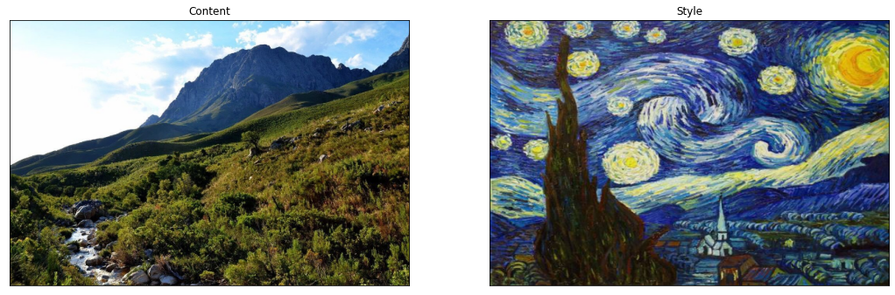
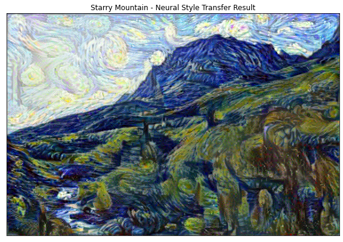

<h1>Neural Style Transfer</h1>
Using the VGG19 model. 
Run in colab, specify path to content and style images, weights and epochs in cell 1 & run all.  

<h3>Example, using the below two images:</h3>

<h3>Results in the below image:</h3>

Any questions can be directed to <a >chadgoldsworthy@gmail.com</a>

